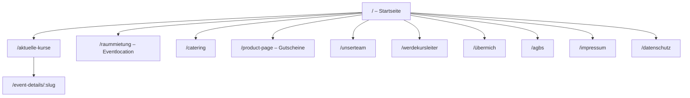
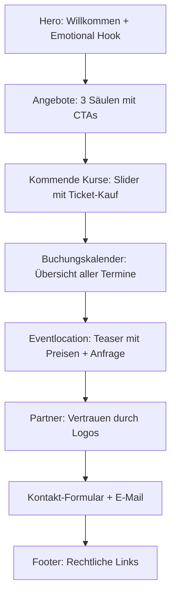

# Analyse – Referenz-Website: kochatelier65.de

> **Analysedatum:** 29. April 2026  
> **Referenz-URL:** https://www.kochatelier65.de/  
> **Branche:** Kochkurse, Eventlocation, Catering (Gastronomie / Erlebnis)  
> **Plattform:** Wix (Website-Baukasten)

---

## 1. Seitenstruktur & Routing

| Route | Seitentyp | Beschreibung |
|---|---|---|
| `/` | Startseite (One-Pager-Stil) | Hero, Angebots-Übersicht, Kurs-Slider, Kalender, Eventlocation-Teaser, Partner, Kontaktformular, Footer |
| `/aktuelle-kurse` | Kurs-Listing | Alle Kurse mit Datum, Titel, CTA ("Mehr Details" / "Warteliste") |
| `/event-details/<slug>` | Kurs-Detailseite | Einzelansicht eines Kurses mit Beschreibung, Datum, Ort, Ticket-Kauf |
| `/raummietung` | Eventlocation | Location-Beschreibung, Ausstattung, Preisspanne, Anfrage-Formular |
| `/kopie-von-catering` | Catering | Catering-Angebot, Anfrage-Formular |
| `/unserteam` | Team-Seite | Kursleiter-Profile mit Foto, Bio, externe Links |
| `/werdekursleiter` | Bewerbungsseite | Benefits-Liste, Bewerbungsformular |
| `/product-page` | Gutschein-Shop | Gutschein-Beschreibung, Kaufoption (E-Commerce) |
| `/übermich` | Über mich | Gründer-Story, persönliche Geschichte, Vision |
| `/agbs` | Rechtlich | AGB |
| `/impressum` | Rechtlich | Impressum |
| `/datenschutz` | Rechtlich | Datenschutzerklärung |

### Sitemap (Mermaid)

---

## 2. Komponenten-Mapping

### Globale Komponenten

| Komponente | Beschreibung |
|---|---|
| **Navbar** | Logo links, Hauptnavigation horizontal (Desktop), Burger-Menü (Mobile). Dropdown für "KURSE" mit Untereinträgen: Aktuelle Kurse, Unser Team, Werde Kursleiter |
| **Footer** | Kontakt-E-Mail, Telefon, rechtliche Links (AGB, Impressum, Datenschutz) |
| **CTA-Buttons** | Durchgängig eingesetzt, z. B. "Kommende Kurse", "Zum Buchungskalender", "Jetzt bewerben", "Tickets kaufen" |

### Seitenspezifische Komponenten

| Seite | Komponenten |
|---|---|
| **Startseite** | Hero-Section (Vollbild mit Headline + Subline), Angebots-Cards (3er-Grid: Kochkurse / Eventlocation / Gastgeber), Kurs-Slider (horizontales Karussell mit 5 Kursen), Buchungskalender (eingebettet), Eventlocation-Teaser mit Preis + Formular, Partner-Karussell (Logo-Slider), Kontakt-Section |
| **Aktuelle Kurse** | Kurs-Liste (vertikale Cards mit Bild, Titel, Datum, CTA) – unterschieden in feste Termine ("Mehr Details") und Warteliste ("unverb. Warteliste") |
| **Event-Details** | Detailansicht: Titel, Datum/Uhrzeit, Adresse, Beschreibung, Ticket-Kauf-Button, Social-Share-Links (LinkedIn etc.) |
| **Eventlocation** | Hero mit Headline, Preis-Info, Features-Liste (Fläche, Multimedia, Design, Küche, Erreichbarkeit), Galerie, Anlässe-Liste, Anfrage-Formular |
| **Catering** | Hero-Headline, Beschreibung, Anfrage-Formular |
| **Team** | Team-Grid mit Kursleiter-Cards: Name, Spezialisierung, Bio-Text, externe Links |
| **Werde Kursleiter** | Hero, Benefits-Liste (5 Punkte mit Icons), Bewerbungsformular |
| **Gutscheine** | Produktbeschreibung, Kaufoptionen (digital/gedruckt), E-Commerce-Widget |
| **Über mich** | Persönliche Geschichte (Storytelling), Abschnitte mit Zwischenüberschriften |

---

## 3. Content-Struktur

### Pro Seite

| Seite | Inhaltstypen |
|---|---|
| **Startseite** | H1-Headline ("Willkommen im Kochatelier 65"), Fließtext, H2-Sektions-Headlines, 3 Angebots-Beschreibungen mit CTAs, Kurs-Cards (Bild + Titel + Datum + Ort + Kurzbeschreibung), Kalender-Widget, Preisangabe, E-Mail-Link, Formular |
| **Aktuelle Kurse** | H2-Headline, Intro-Text, Event-Karten (ca. 20 Einträge) mit: Bild, Titel, Datum, CTA-Link |
| **Eventlocation** | H1-Headlines (2), Fließtext, Preisrange (85–130 €/Person), Feature-Bulletpoints, Anlässe-Bulletpoints, CTA-Formular |
| **Catering** | H1-Headlines, Fließtext (emotional, storytelling-orientiert), Anfrage-Formular |
| **Team** | H1-Headline, Intro-Text, ~10 Kursleiter-Profile (H6-Name, Bio-Paragraph, externe Links) |
| **Werde Kursleiter** | H1 + H2, Fließtext, 5 Benefits (H2 + Beschreibung), Bewerbungsformular |
| **Gutscheine** | Produkttext (Bestellung, Einlösung, Gültigkeit), E-Commerce-Kaufelement |
| **Über mich** | Persönlicher Fließtext, H6-Zwischenüberschriften, Storytelling in 3 Abschnitten |

### Content-Patterns

- **Sprache:** Du-Ansprache, persönlich, emotional, warm
- **Tone of Voice:** Familiär, einladend, authentisch – kein Corporate-Speak
- **Wiederholte Muster:** Headline → Subline/Fließtext → CTA-Button

---

## 4. Design-Patterns

### Layout-Grid

- **Seitenbreite:** Full-width Sections mit zentriertem Content-Container
- **Grid:** Primär Single-Column, 3er-Grid für Angebots-Cards auf der Startseite
- **Spacing:** Großzügige vertikale Abstände zwischen Sektionen (ca. 80–120px)

### Farbschema (geschätzt)

| Rolle | Farbe (geschätzt) |
|---|---|
| **Hintergrund** | Weiß / Hellbeige (#FFFFFF / #FAF8F5) |
| **Text primär** | Dunkelbraun / Schwarz (#2D2D2D) |
| **Akzentfarbe** | Warmes Gold / Erdton |
| **CTA-Buttons** | Dunkler Ton (Schwarz oder Dunkelbraun) |
| **Sektionen** | Wechsel zwischen Weiß und leichtem Beige/Creme |

### Typografie-Hierarchie

| Element | Stil |
|---|---|
| **H1** | Groß, Uppercase, wahrscheinlich Serif oder elegante Sans-Serif |
| **H2** | Uppercase, etwas kleiner als H1 |
| **H6 (Team-Namen)** | Klein, Uppercase, als Label-Style |
| **Fließtext** | Standard Sans-Serif, gut lesbar, ca. 16–18px |
| **CTA-Buttons** | Uppercase, Tracking/Letter-Spacing erhöht |

### Animationen

- **Scroll-Animationen:** Fade-In / Slide-Up bei Sektionswechsel (Wix-Standard)
- **Kurs-Karussell:** Horizontaler Slider mit Swipe-Unterstützung
- **Partner-Slider:** Auto-Play Logo-Karussell ("press and hold to play")
- **Hover-Effekte:** Auf Cards und Buttons

---

## 5. UX-Flow

### Nutzerführung auf der Startseite

### CTA-Strategie

| CTA | Ziel | Platzierung |
|---|---|---|
| "Kommende Kurse" | → Kurs-Sektion / Kurs-Listing | Angebots-Card |
| "Zum Buchungskalender" | → Kalender-Sektion | Angebots-Card |
| "Jetzt bewerben" | → /werdekursleiter | Angebots-Card + eigene Seite |
| "Tickets kaufen" | → /event-details/:slug | Kurs-Cards |
| "Mehr Details" | → /event-details/:slug | Kurs-Listing |
| "unverb. Warteliste" | → Event-Detail (Warteliste) | Kurs-Listing (ohne festen Termin) |
| "Stell eine Anfrage" | → Formular (inline) | Eventlocation, Catering |

### Navigation

- **Desktop:** Horizontale Navbar, fixiert oben (sticky). "KURSE" als Dropdown mit 3 Unterseiten
- **Mobile:** Burger-Menü → Vollbild-Overlay oder Drawer
- **Scroll:** Smooth-Scroll zu Sektionen auf der Startseite (Anker-Links)
- **Kontakt:** Auf fast jeder Seite ein Formular oder zumindest E-Mail-Link

---

## 6. Technische Hinweise

### Plattform & Technologie

| Aspekt | Erkenntnis |
|---|---|
| **CMS/Plattform** | **Wix** (erkennbar an URL-Struktur, Widget-Embedding, Seitenstruktur) |
| **Events/Buchung** | Wix Events (integriertes Ticket-System mit Checkout) |
| **E-Commerce** | Wix Stores (Gutschein-Seite als Produkt) |
| **Kalender** | Eingebettetes Wix-Booking / Google Calendar Widget |
| **Formulare** | Wix Forms (Kontakt, Bewerbung, Catering-Anfrage) |

### SEO-Struktur

| Element | Vorhanden | Beispiel |
|---|---|---|
| **Title-Tag** | ✅ | "Kochkurse in Wiesbaden \| Kochatelier65" |
| **OG Description** | ✅ | Individuelle Beschreibungen pro Seite |
| **OG Image** | Vermutlich ✅ | (Wix generiert automatisch) |
| **Sitemap** | ✅ (Wix-Standard) | Automatisch generiert |
| **Semantisches HTML** | ⚠️ Eingeschränkt | Wix generiert Div-basiertes Markup |
| **URLs** | ⚠️ Teilweise suboptimal | z. B. `/kopie-von-catering`, `/product-page` |

### Performance-Patterns

- Wix liefert automatisch CDN, Lazy-Loading für Bilder
- Bilder sind teils unkomprimiert (Wix-Standard)
- Keine erkennbare manuelle Performance-Optimierung
- Kein SSR/SSG (Wix rendert Client-seitig)

---

## 7. Mobile-Analyse

### Responsives Verhalten

| Aspekt | Verhalten |
|---|---|
| **Navigation** | Burger-Menü (Hamburger-Icon), öffnet als Overlay/Drawer |
| **Layout** | Single-Column auf Mobile, 3er-Grid → 1er-Column auf kleinen Screens |
| **Bilder** | Wix Responsive-Images (automatische Skalierung) |
| **Kurs-Slider** | Swipe-fähig, 1 Card pro View auf Mobile |
| **Kalender** | Eingebettet, scrollbar |
| **Formulare** | Full-Width Inputs auf Mobile |
| **Text** | Schriftgrößen skalieren leicht herunter |
| **CTAs** | Full-Width Buttons auf Mobile |

### Breakpoints (Wix-Standard)

| Breakpoint | Beschreibung |
|---|---|
| **≤ 750px** | Mobile-Layout |
| **> 750px** | Desktop-Layout |

> **Hinweis:** Wix arbeitet mit nur 2 Breakpoints (Mobile/Desktop), kein echtes Tablet-Layout. Für das eigene Projekt nutzen wir Tailwind-Defaults (sm/md/lg/xl/2xl) für eine feinere Abstufung.

---

## 8. Zusammenfassung & Ableitung

### Stärken der Referenz

- **Emotionale Ansprache:** Persönlich, warm, Du-Ansprache – schafft Vertrauen
- **Klare Struktur:** Startseite als Hub, gut verlinkt zu Unterseiten
- **Event-System:** Integrierter Kalender + Ticket-Kauf direkt auf der Seite
- **Vielfältiges Angebot:** 3 Säulen (Kurse, Eventlocation, Kursleiter werden) klar kommuniziert
- **Social Proof:** Partner-Logos, Team-Profile mit echten Geschichten

### Schwächen / Verbesserungspotenzial

- **URL-Struktur:** Teilweise unsauber (`/kopie-von-catering`, `/product-page`)
- **Responsiveness:** Nur 2 Breakpoints (Wix-Limitierung), kein Tablet-Layout
- **Performance:** Wix-typische Einschränkungen (schweres JS-Bundle, kein SSR)
- **Semantisches HTML:** Div-lastig (Wix-Standard), schlecht für Accessibility
- **SEO:** Meta-Daten vorhanden, aber URL-Slugs und Heading-Hierarchie verbesserungswürdig (H6 für Team-Namen statt H3)
- **Gutschein-Seite:** Nur 1 Produkt, kein eigener Gutschein-Konfigurator

### Kernfunktionen für das eigene Projekt

1. **Kurs-Verwaltung** mit Listing, Detail-Ansicht, Ticket-/Wartelisten-System
2. **Eventlocation-Seite** mit Features, Galerie, Anfrage-Formular
3. **Catering-Anfrage** mit Formular
4. **Team-Seite** mit Kursleiter-Profilen
5. **Gutschein-Shop** (E-Commerce)
6. **Bewerbungsformular** für neue Kursleiter
7. **Integrierter Kalender** (Events-Übersicht)
8. **Kontaktformular** (auf mehreren Seiten)
9. **Gründer-Story** (Über mich)
10. **Rechtliche Seiten** (AGB, Impressum, Datenschutz)
